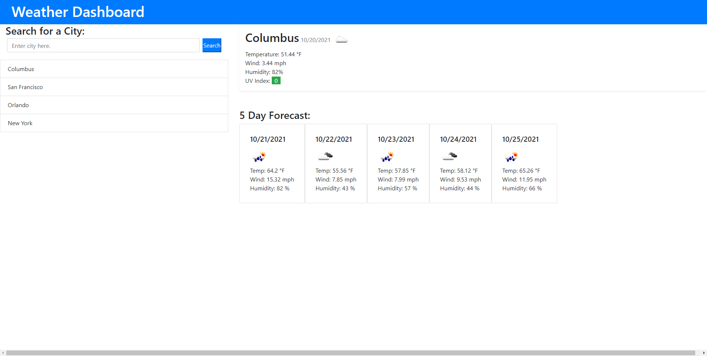

# weather-app

## Description

I set out to create an application that addresses the following user story:

AS A traveler
I WANT to see the weather outlook for multiple cities
SO THAT I can plan a trip accordingly

In completing this application, I gained more experience with JQuery and using third party APIs.  I used multiple Open Weather APIs to pull and display useful data to the user, such as temperature, wind speed, humidity percentage, and UV index.  I also gained more experience with using Bootstrap as a way to easily add CSS styling.

## Table of Contents

- [Installation](#installation)
- [Usage](#usage)
- [License](#license)

## Installation

This application runs in the browswer and requires no installation by the user.

## Usage

Provide instructions and examples for use. Include screenshots as needed.
To add a screenshot, create an `assets/images` folder in your repository and upload your screenshot to it. Then, using the relative filepath, add it to your README using the following syntax:
    ```md
    
    ```

## License

The last section of a high-quality README file is the license. This lets other developers know what they can and cannot do with your project. If you need help choosing a license, refer to [https://choosealicense.com/](https://choosealicense.com/).